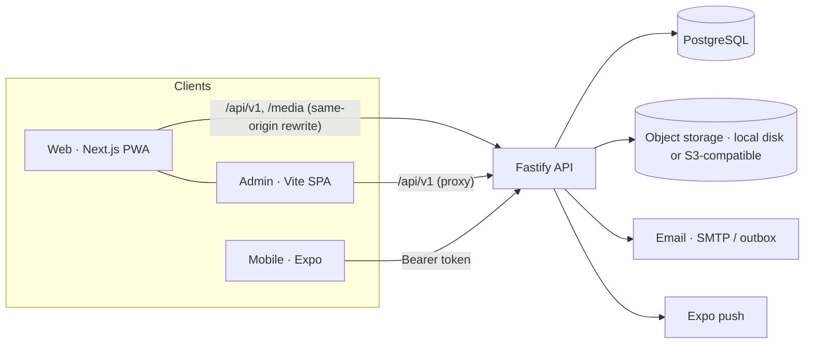

# Architecture

## Decisions
- **Monorepo with one contract.** `@unsaid/shared` (zod schemas + DTO types + constants) and `@unsaid/api-client` (typed fetch client, PoW solver)
  are used by web, admin and mobile, so a contract change breaks the build instead of production. (The `@unsaid/*` package scope is an internal name.)
- **Fastify, not Nest/Next route handlers.** A standalone API serves three different clients, starts fast, and keeps security plugins explicit.
- **Drizzle + SQL migrations.** No engine binary, typed queries, reviewed plain-SQL migrations (`apps/api/migrations`).
- **Sessions, not JWT.** Opaque 256-bit tokens, stored hashed, revocable; cookie for web/admin (httpOnly, SameSite=Lax, CSRF header + Origin check),
  Bearer for mobile (SecureStore).
- **Same-origin web.** Next rewrites `/api/v1` and `/media` to the API, so cookies are first-party and there is no CORS surface for the web app.
- **Anonymity model.** Messages store a keyed HMAC of the sender's network address and a device cookie (for blocking, flood and duplicate detection),
  never exposed and purged after the retention window (default 30 days). Senders have no accounts, so admin "ban" acts on a *source hash*.
- **Layered abuse control.** Per-IP / per-recipient / global rate limits (sliding window, store interface ready for Redis), risk-based proof-of-work
  challenge (no third-party CAPTCHA), duplicate suppression, rule-based moderation with hold/reject, hidden words, enhanced mode.
- **Notifications abstraction.** `NotificationService` fans out to `Channel`s (in-app, Expo push, email) behind per-user preferences, with coalescing.
- **Rounds.** An extra link is an anonymous round: own question (`prompt`), optional `closes_at`, own stats and inbox filter.
- **i18n.** English + Hebrew. Web/admin/mobile use typed dictionaries (Hebrew must contain every English key), RTL via logical CSS / RN start-end;
  the API localises errors (`x-lang` or Accept-Language), emails and notifications per user locale.
- **PWA instead of stores.** `/install` + manifest + a privacy-safe service worker (never caches API or user pages) give a zero-cost install path.

## Request flow: anonymous message
validate → resolve link → closed/paused/suspended? → rate limits → risk → (proof of work) → platform ban → recipient block → duplicate →
hidden words + moderation → store (inbox or filtered) → notify (in-app / push / email, coalesced).

## Folder map
`apps/api/src/{routes,services,moderation,plugins,lib,i18n,db}` · `apps/web/src/{app,components,i18n,lib}` · `apps/mobile/{app,src}` ·
`apps/admin/src` · `packages/*` · `docs` · `scripts` · `deploy` · `.devcontainer`
