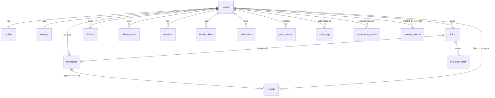

# EAR database

PostgreSQL 16, Drizzle ORM for typed queries, plain SQL migrations in `apps/api/migrations` (`0001_init.sql`, `0002_rounds.sql`), applied by `src/db/migrate.ts` (also run by the test global setup). Schema mirror: `apps/api/src/db/schema.ts`.

## ER overview

Standalone: `email_outbox` (dev/test mail sink).

## Tables

| Table | Purpose / notable columns |
|---|---|
| `users` | `email`, `username` (both lowercase by CHECK), `password_hash`, `role` user/moderator/admin, `status` active/suspended/banned, `email_verified_at`, `username_changed_at`, `last_seen_at` |
| `profiles` | 1:1 `user_id` PK; `display_name` 1-40, `bio` <=160, `prompt` <=80, `avatar_key` |
| `settings` | 1:1; `enhanced_moderation`, `accepting_messages`, `show_answers_publicly`, `notifications` jsonb prefs |
| `links` | Primary link (exactly one per user) + rounds. `slug` unique `[A-Za-z0-9_-]{4,32}`, `label` 1-40, `paused`, `paused_until`, `prompt` 1-120, `closes_at` |
| `link_daily_stats` | PK (`link_id`, `day`); `views`, `messages` counters |
| `messages` | `recipient_id`, `link_id`, `body` 1-2000 (API limit 500), `status` inbox/filtered/archived, `read_at`, **`source_hash`, `device_hash`** (nullable, retention), `body_hash`, `filtered_categories[]`, reply fields, `answer_id` (unique public id) |
| `blocks` | owner + `source_hash` and/or `device_hash`, `label` |
| `reports` | evidence snapshot (`message_body`, `message_created_at`, `filtered_categories`, `source_hash`), `status`, `resolution`, `resolved_by/at` |
| `sessions` | `token_hash` (SHA-256), `user_agent`, `expires_at`, `revoked_at`, `last_used_at` |
| `email_tokens` | `kind` verify/reset, `token_hash`, `expires_at`, `used_at` |
| `notifications` | `type` new_message/message_activity/safety, title/body, `data` jsonb (holds coalesce key/count), `read_at` |
| `push_tokens` | unique `token`, `platform` |
| `hidden_words` | unique (`user_id`, `word`), 2-40 chars |
| `moderation_events` | append-only log: `kind` message/report/admin_action, `outcome`, `categories[]`, `score`, `source_hash` |
| `audit_logs` | `actor_id`, `action`, `target_type/id`, `meta` jsonb |
| `banned_sources` | unique `source_hash`, `until` (null = permanent), `created_by` |

## Constraints worth knowing

* `users_email_lower`, `users_username_lower`, `users_username_format` (3-24, `^[a-z0-9]([a-z0-9_]*[a-z0-9])?$`).
* `links_one_primary_per_user` partial unique index; `links_slug_key` unique.
* `blocks_has_target` CHECK (hash or device); unique per owner on each of source/device (partial) - makes block idempotent under races.
* `reports_reporter_message_key` partial unique (reporter, message) - report idempotency.
* `answer_id` UNIQUE; `sessions_token_key`, `email_tokens_hash_key`, `push_tokens_token_key` unique.
* CHECKs mirror enum values (`role`, `status`, report `reason`, etc.).
* Application-level (not DB): max 10 links, max 100 hidden words, username change once / 7 days, duplicate suppression (advisory lock `pg_advisory_xact_lock(hash(recipient:bodyHash))` makes check+insert atomic).

## Indexes (hot paths)

Inbox `messages(recipient_id, status, created_at desc, id desc)` · duplicate `messages(recipient_id, body_hash, created_at desc)` · source lookups (partial, non-null) · public answers (partial on `reply_public and answer_id is not null`) · per link `messages(link_id, created_at desc)` · reports `(status, created_at desc, id desc)` and `(source_hash)` · notifications `(user_id, created_at desc, id desc)` and unread partial · events `(created_at desc, id desc)`, `(source_hash, created_at desc)`, `(outcome, created_at desc)` · sessions partial on active · all keyset pagination uses `(created_at, id)`.

## Cascade rules

| Parent delete | Effect |
|---|---|
| `users` | CASCADE: profile, settings, links, messages, blocks, hidden_words, sessions, email_tokens, notifications, push_tokens, reports (as reporter or recipient). SET NULL: `audit_logs.actor_id`, `moderation_events.user_id`, `banned_sources.created_by`, `reports.resolved_by` |
| `links` | messages `link_id` SET NULL (messages survive), `link_daily_stats` CASCADE |
| `messages` | `reports.message_id` and `moderation_events.message_id` SET NULL (evidence survives) |

## Retention

See SECURITY.md section 7. `runMaintenance` (src/services/maintenance.ts) is the single implementation and is covered by `tests/integration/retention.test.ts`. Hash columns are the only privacy-sensitive data and are nulled, never the content. Migrations are forward-only; take a backup before running them in production.
